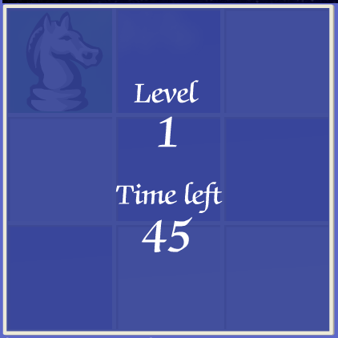
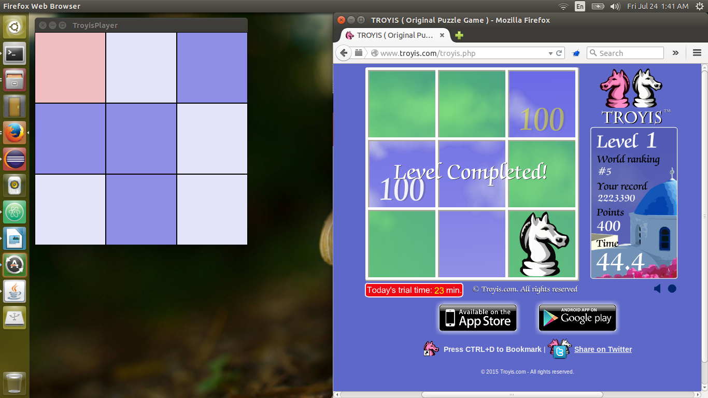

#### TroyisPlayer

This project is a joint work with Amir Hossein Shahriari, done in 3 days of April 2011; when I was a Java newbie. We wrote it in our university site where we have had really great times. :) Oh, nevermind! I got really sensual! This project brings many memories back...
OK! About the project:

How to Build:
* `mvn clean install`

Run:
* Open this [link](http://www.troyis.com) in your browser (The page of the Troyis game) and click on _Play Now_, enter your name and before clicking on play run the application. Then move your browser to the left and click on _play for free_; and wait for the game to start. (Remember not to move your browser after starting the program). When you can see this:

the game is going to start. After starting the game our code opens a window and shows what it understands of the game. like this: 

Then it starts to click on the proper places. Just watch and enjoy!

How to Run:
* `java -cp target/TroyisPlayer-0.0.1.jar org.troyisPlayer.main.Troyis` 
* You can start the application in Eclipse. Run Troyis class
* You can manipulate the delay between each moves, the bigger the delay, the slower the moves.

Known Bugs:
* In higher levels, some of empty rooms, get detected as full ones.
